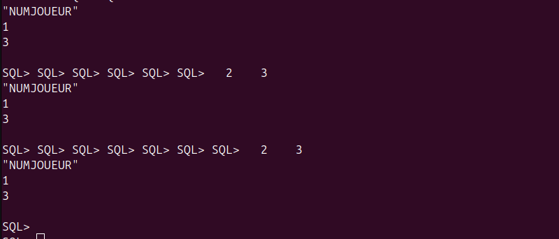

# Compte Rendu - TP1 : Installation et Gestion d'Oracle 21c XE sur Docker

**Préparé par :** Otmanesabiri  
**Date :** 17 Mars 2025  


```bash
# Vérifier l'état du conteneur 

docker ps -a | grep glsid2025

# Démarrer le conteneur

docker start glsid2025

# Attendre que Oracle soit complètement initialisé (peut prendre 2-5 minutes) 
docker logs -f glsid2025

```


### Se connecter à SQL*Plus :

```bash
docker exec -it glsid2025 sqlplus sys/Glsid2024-2025@XE as sysdba

```


### Localisation du fichier glogin.sql

```bash
docker exec -it glsid2025 bash -c "ls -la /opt/oracle/product/*/dbhome*/sqlplus/admin/glogin.sql"
```


### Visualiser le contenu de glogin.sql

```bash
docker exec -it glsid2025 cat /opt/oracle/product/21c/dbhomeXE/sqlplus/admin/glogin.sql
```


#### Personnalisation de SQL*Plus pour notre Travail

```bash
# Faire une copie de sauvegarde d'abord
docker exec -it glsid2025 cp /opt/oracle/product/21c/dbhomeXE/sqlplus/admin/glogin.sql /opt/oracle/product/21c/dbhomeXE/sqlplus/admin/glogin.sql.bak
```


```bash
# Ajouter vos personnalisations
docker exec -it glsid2025 bash -c "echo 'SET PAGESIZE 50' >> /opt/oracle/product/21c/dbhomeXE/sqlplus/admin/glogin.sql"
docker exec -it glsid2025 bash -c "echo 'SET LINESIZE 120' >> /opt/oracle/product/21c/dbhomeXE/sqlplus/admin/glogin.sql"
docker exec -it glsid2025 bash -c "echo 'COLUMN NomJ FORMAT A20' >> /opt/oracle/product/21c/dbhomeXE/sqlplus/admin/glogin.sql"
```


## si le repertoire /home/oracle n'existe pas créer le d'abord


```bash
# Créer d'abord le répertoire home pour l'utilisateur oracle 
docker exec -it glsid2025 mkdir -p /home/oracle
docker exec -it glsid2025 chown oracle:oinstall /home/oracle
```


## et si vous rencontrez des problèmes de permissions 

### Solution alternative pour le fichier login.sql

# Utiliser le répertoire /tmp (toujours accessible en écriture) :


```bash
docker exec -it glsid2025 mkdir -p /tmp/oracle_config
```


```bash
docker exec -it glsid2025 bash -c "echo '-- Paramètres pour le TP GLSID' > /tmp/oracle_config/login.sql"
docker exec -it glsid2025 bash -c "echo 'SET PAGESIZE 50' >> /tmp/oracle_config/login.sql"
docker exec -it glsid2025 bash -c "echo 'SET LINESIZE 120' >> /tmp/oracle_config/login.sql"
docker exec -it glsid2025 bash -c "echo 'COLUMN NomJ FORMAT A20' >> /tmp/oracle_config/login.sql"
docker exec -it glsid2025 bash -c "echo 'COLUMN PrenomJ FORMAT A20' >> /tmp/oracle_config/login.sql"
```


## Vérifier la création du fichier :

```bash
docker exec -it glsid2025 ls -la /tmp/oracle_config/
```


## Utiliser le fichier avec SQL*Plus :

```bash
docker exec -it glsid2025 sqlplus -L sys/Glsid2024-2025@XE as sysdba @/tmp/oracle_config/login.sql
```


## Premières commandes de vérification (dans SQL*Plus) :

```bash
-- Vérifier les paramètres
SHOW PAGESIZE
SHOW LINESIZE

-- Vérifier la connexion
SELECT * FROM v$version;
SELECT username FROM dba_users;
```


## Création des tables Equpies et Joueurs


```bash
-- Table Equipes
CREATE TABLE Equipes (
    NumEquipe INT NOT NULL,
    Pays VARCHAR2(20),
    CONSTRAINT Equipes_pk PRIMARY KEY (NumEquipe)
);

-- Table Joueurs
CREATE TABLE Joueurs (
    NumJoueur INT NOT NULL,
    NomJ VARCHAR2(20),
    PrenomJ VARCHAR2(20),
    DateNaissance DATE,
    NumEquipe INT,
    CONSTRAINT Joueurs_pk PRIMARY KEY (NumJoueur),
    CONSTRAINT Joueurs_Equipes_fk FOREIGN KEY (NumEquipe) REFERENCES Equipes(NumEquipe)
);
```


## Insertion des données 

```bash
-- Equipes
INSERT INTO Equipes VALUES (1, 'Maroc');
INSERT INTO Equipes VALUES (2, 'France');
INSERT INTO Equipes VALUES (3, 'Espagne');
INSERT INTO Equipes VALUES (4, 'Argentine');

-- Joueurs
INSERT INTO Joueurs VALUES (1, 'Ayoubi', 'Rachid', TO_DATE('10/02/1980', 'DD/MM/YYYY'), 1);
INSERT INTO Joueurs VALUES (2, 'Jack', 'Robert', TO_DATE('22/06/1977', 'DD/MM/YYYY'), 2);
INSERT INTO Joueurs VALUES (3, 'Arabi', 'Omar', TO_DATE('16/12/1979', 'DD/MM/YYYY'), 1);
INSERT INTO Joueurs VALUES (4, 'Garcia', 'David', TO_DATE('13/01/1980', 'DD/MM/YYYY'), 3);
INSERT INTO Joueurs VALUES (5, 'Iose', 'George', TO_DATE('30/05/1970', 'DD/MM/YYYY'), 4);
INSERT INTO Joueurs VALUES (6, 'Roberto', 'Claude', TO_DATE('16/10/1981', 'DD/MM/YYYY'), 2);

COMMIT;
```


### Exécution des requêtes 

```bash
-- Requête 1: Noms des joueurs
SELECT NomJ FROM Joueurs;

-- Requête 2: Noms et prénoms
SELECT NomJ, PrenomJ FROM Joueurs;

-- Requête 5: Joueurs du Maroc ou de France
SELECT J.NomJ
FROM Joueurs J, Equipes E
WHERE J.NumEquipe = E.NumEquipe AND (E.Pays='Maroc' OR E.Pays='France');
```


#### Gestion des résultats

## Pour exporter en CSV :

```bash
SPOOL /tmp/oracle_config/resultats.csv
SET MARKUP CSV ON DELIMITER ',' QUOTE ON
SELECT * FROM Joueurs;
SPOOL OFF
```


## Récupérer les fichiers :

```bash
docker cp glsid2025:/tmp/oracle_config/resultats.csv .
```


####  Requêtes avancées 

```sql

-- Requête 6: Num-Equipe de "Garcia"
SELECT E.NumEquipe 
FROM Joueurs J, Equipes E
WHERE J.NumEquipe = E.NumEquipe AND J.NomJ='Garcia';

-- Requête 7: Nom-Pays de "Jack"
SELECT E.Pays
FROM Joueurs J, Equipes E
WHERE J.NumEquipe = E.NumEquipe AND J.NomJ='Jack';

-- Requête 8: Pays pour noms commençant par "J"
SELECT DISTINCT E.Pays
FROM Joueurs J, Equipes E
WHERE J.NumEquipe = E.NumEquipe AND J.NomJ LIKE 'J%';

-- Requête 9: Pays pour noms finissant par "i"
SELECT DISTINCT E.Pays
FROM Joueurs J, Equipes E
WHERE J.NumEquipe = E.NumEquipe AND J.NomJ LIKE '%i';

```


####  Export des résultats

```sql
-- Export texte
SPOOL /tmp/oracle_config/resultat_requete10.txt
SELECT J.NumJoueur
FROM Joueurs J, Equipes E
WHERE J.NumEquipe = E.NumEquipe AND E.Pays='Maroc';
SPOOL OFF

-- Export HTML
SPOOL /tmp/oracle_config/resultat_requete10.html
SET MARKUP HTML ON
SELECT J.NumJoueur
FROM Joueurs J, Equipes E
WHERE J.NumEquipe = E.NumEquipe AND E.Pays='Maroc';
SPOOL OFF
SET MARKUP HTML OFF

-- Export CSV
SPOOL /tmp/oracle_config/resultat_requete10.csv
SET MARKUP CSV ON DELIMITER ',' QUOTE ON
SELECT J.NumJoueur
FROM Joueurs J, Equipes E
WHERE J.NumEquipe = E.NumEquipe AND E.Pays='Maroc';
SPOOL OFF
```


#### Agrégations et statistiques

```sql
-- 7. Nombre d'équipes par ID
SELECT COUNT(*), NumEquipe
FROM Equipes
GROUP BY NumEquipe;

-- 8. Nombre de joueurs distincts par équipe
SELECT COUNT(DISTINCT NumEquipe)
FROM Joueurs;

-- 9. Equipes avec plus d'un joueur
SELECT COUNT(*), NumEquipe
FROM Joueurs
GROUP BY NumEquipe
HAVING COUNT(*) > 1;
```


#### Transaction avec savepoint

```sql
-- Début de transaction
SET TRANSACTION NAME 'TP2_Transaction';
SAVEPOINT avant_modification;

-- Modification test
UPDATE Equipes SET Pays='MOROCCO' WHERE NumEquipe=1;
SELECT * FROM Equipes WHERE NumEquipe=1;

-- Annulation
ROLLBACK TO SAVEPOINT avant_modification;
SELECT * FROM Equipes WHERE NumEquipe=1;

-- Validation
COMMIT COMMENT 'Transaction TP2';
```


#### Gestion des vues

```sql
-- Création de la vue
CREATE VIEW Vue_Joueurs_Maroc_France AS
SELECT J.NomJ
FROM Joueurs J, Equipes E
WHERE J.NumEquipe = E.NumEquipe AND (E.Pays='Maroc' OR E.Pays='France');

-- Création utilisateur pour la vue
ALTER SESSION SET "_ORACLE_SCRIPT"=TRUE;
CREATE USER TP2vue IDENTIFIED BY TP2vue;
GRANT CONNECT TO TP2vue;
GRANT SELECT ON Vue_Joueurs_Maroc_France TO TP2vue;

-- Test de la vue
CONNECT TP2vue/TP2vue
SELECT * FROM SYS.Vue_Joueurs_Maroc_France;
```


#### Gestion des index

Oracle crée automatiquement des index pour les clés primaires.
Il est redondant de créer des index sur des colonnes déjà indexées.
L'intérêt est de créer des index sur :
Des colonnes fréquemment utilisées dans les WHERE
Des colonnes utilisées pour les jointures
Des combinaisons de colonnes (index composites)

```sql
-- Vérification des index
-- Création des index
SELECT index_name, table_name, column_name 
FROM all_ind_columns 
WHERE table_name IN ('EQUIPES', 'JOUEURS')
ORDER BY index_name;

-- Créez des index sur des colonnes non encore indexées

-- Index sur Pays dans Equipes
CREATE INDEX idx_equipes_pays ON SYS.Equipes(Pays);

-- Index sur NomJ dans Joueurs
CREATE INDEX idx_joueurs_nom ON SYS.Joueurs(NomJ);

-- Index composite
CREATE INDEX idx_joueurs_equipe_nom ON SYS.Joueurs(NumEquipe, NomJ);

```


#### Nettoyage final

```sql
-- Suppression des enregistrements
DELETE FROM Joueurs;
DELETE FROM Equipes;

-- Suppression des tables
DROP TABLE Joueurs CASCADE CONSTRAINTS;
DROP TABLE Equipes CASCADE CONSTRAINTS;

-- Suppression de la vue
DROP VIEW Vue_Joueurs_Maroc_France;

-- Suppression des utilisateurs
DROP USER TP2 CASCADE;
DROP USER TP2vue CASCADE;
```
 #### Pour récupérer vos fichiers résultats

```bash
docker cp glsid2025:/tmp/oracle_config/resultat_requete10.txt .
docker cp glsid2025:/tmp/oracle_config/resultat_requete10.html .
docker cp glsid2025:/tmp/oracle_config/resultat_requete10.csv .
```


### Astuces pratiques

## Pour réutiliser facilement votre configuration :

```bash
alias sqlplus-tp='docker exec -it glsid2025 sqlplus -L sys/Glsid2024-2025@XE as sysdba @/tmp/oracle_config/login.sql'
```
## Pour voir les tables créées :

```bash
SELECT table_name FROM user_tables;
```
## Pour décrire une table :

```bash
DESC Joueurs;
```

